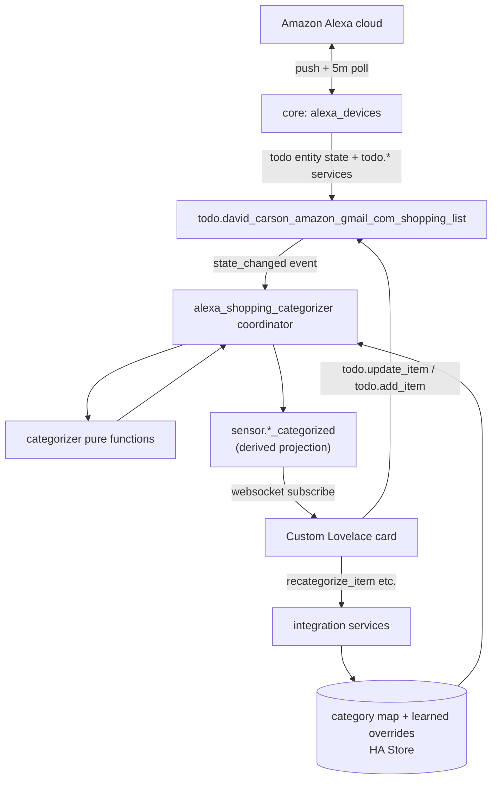

# 00 — Executive Summary

## What the project does

Presents the user's Alexa shopping list in Home Assistant as a **category-grouped** view
(Produce, Milk, Chilled, Fake Meat, Bakery, Frozen, Drinks, Pantry, Household, Uncategorized),
with **reactive live updates**, **optimistic tick-off with a per-item undo grace period**, and
**two-way sync** back to the Alexa list. Categorization is seeded from a vegan-appropriate
default taxonomy plus the current list contents, and **learns over time** from manual
corrections.

## The problem it solves

The Alexa/Home Assistant shopping list is a flat, unordered list. Shopping in a store is much
faster when items are grouped by aisle/category and you can tick items off with a safety net
for mis-taps. The user is vegan, so the categorization must avoid animal-derived categories and
make sensible plant-based assumptions (milk items are plant milk; "bacon" is a fake-meat
substitute).

## Primary user

A single household power-user running Home Assistant OS (2026.8.3) with the core
`alexa_devices` integration already configured and HACS installed.

## High-level architecture

Two reconciled flows:

- **Inbound:** source list changes (from Alexa or anywhere) → coordinator recomputes the
  categorized projection → sensor updates → card re-renders.
- **Outbound:** card action → optimistic UI → after grace period → native `todo.*` service on
  the source entity → inbound flow reconciles (idempotent no-op if already matching).

## Recommended implementation approach

A **custom, config-flow-based Home Assistant integration** (`alexa_shopping_categorizer`),
HACS-distributable, plus a **bundled custom Lovelace card**. This overrides the original spec's
pyscript approach. Full justification and alternatives are in
[03-architecture.md](03-architecture.md).

Rationale in brief: config flow, `DataUpdateCoordinator`, first-class entities, services,
diagnostics, stable unique IDs, migrations, and a proper test harness — none of which pyscript
provides cleanly — and it aligns with how the underlying `alexa_devices` integration already
works.

## Key reality-based design decisions

- **Source entity is the `alexa_devices` todo list**, not the native `todo.shopping_list`
  (which is empty and unrelated). See [02-environment-analysis.md](02-environment-analysis.md).
- **No history mining.** The `alexa_devices` todo entity retains completed items and exposes
  them via `todo.get_items`; that live corpus (active + completed) seeds categorization. HA
  recorder has no usable history for this entity anyway.
- **Reactivity via state-change events**, not by polling Amazon — the underlying integration
  already pushes updates and calls `async_update_listeners`.
