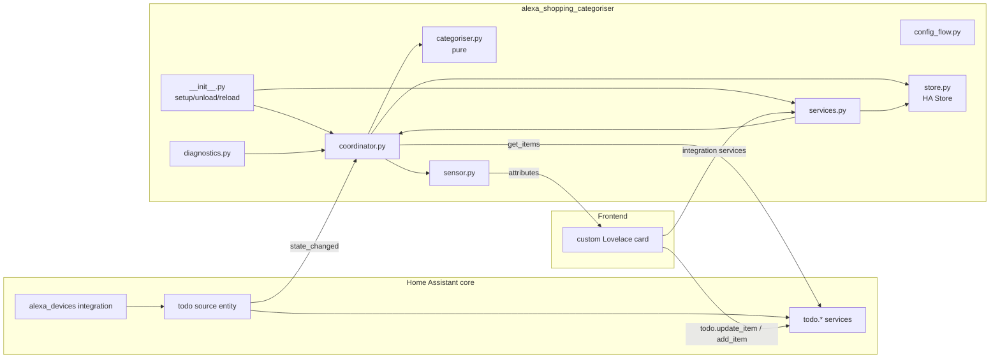

# 03 — Architecture

## Recommended approach: custom integration + bundled card

Implement `alexa_shopping_categoriser` as a **config-flow custom integration**, distributed via
HACS, with a **bundled custom Lovelace card**.

### Alternatives considered

| Option | Verdict | Why |
|--------|---------|-----|
| **Custom integration + card** (recommended) | ✅ Chosen | Config flow, coordinator, first-class entities/services, diagnostics, stable unique IDs, migrations, proper `pytest` harness, HACS distribution. Matches how `alexa_devices` itself is built. |
| pyscript + template sensor + standalone card (original spec) | ❌ | pyscript not installed; weak typing/testing story; no config/options flow, diagnostics, or migrations; global-namespace fragility; harder to review and maintain. |
| `python_script` | ❌ | Sandboxed, no imports, no async, no persistence helpers — cannot host the coordinator/service model. |
| Standalone external service + webhook | ❌ | Adds a network hop, credentials, SSRF surface, and a second process to run; contradicts the "local, no outbound calls" security posture. Unjustified for a local list. |
| HA add-on | ❌ | Heavyweight (container lifecycle) for what is in-process logic; no benefit here. |

### Trade-offs of the chosen approach

- More upfront scaffolding than pyscript, but far better maintainability, testability, and
  UX (native setup, diagnostics, reload).
- The bundled card is extra frontend work vs. reusing the stock to-do card, but the stock card
  cannot express categories, per-item undo grace periods, or collapse behavior.

## Components

## External systems

- **Amazon Alexa cloud** — reached only indirectly, via the core `alexa_devices` integration.
  This integration never talks to Amazon directly.

## Data flow

See [08-update-and-sync-strategy.md](08-update-and-sync-strategy.md) for full sequences.
Summary:

- **Inbound (read):** source `state_changed` → coordinator pulls items (`todo.get_items`,
  both statuses) → categoriser builds projection → sensor attributes updated → card renders.
- **Outbound (write):** card action → optimistic local state → (grace period) →
  `todo.update_item`/`todo.add_item` on source → inbound flow reconciles.

## Control flow

- Setup creates the store + coordinator, does a first refresh, registers services, forwards
  the sensor platform, and subscribes to source `state_changed`.
- The coordinator owns all recomputation; entities and services never compute categories
  themselves — they call the coordinator/categoriser.

## Authentication & authorisation

- **Authentication:** none owned here. Alexa auth is entirely within `alexa_devices`.
- **Authorisation:** the card operates as the logged-in HA user; all writes go through HA
  services which enforce HA's own auth. No elevation, no bypass.

## Configuration

- Config entry stores the selected **source todo entity id** and options (grace-period
  seconds, show-completed toggle, diagnostics redaction). Category map + learned overrides live
  in the HA `Store` (see doc 06), keyed by config entry.

## Persistence

- **HA Store** (`.storage/alexa_shopping_categoriser.<entry_id>`): category map + learned
  overrides + schema version. Rebuildable UI state (the projection) is **not** persisted — it
  is always derived.

## Error-handling boundaries

- Coordinator converts source/read failures into `UpdateFailed`; setup raises
  `ConfigEntryNotReady` if the source entity is absent.
- Service/write failures become `HomeAssistantError` at the boundary, with retry/backoff and a
  user-visible surface (see doc 09). Optimistic UI is reverted on exhausted retries.
