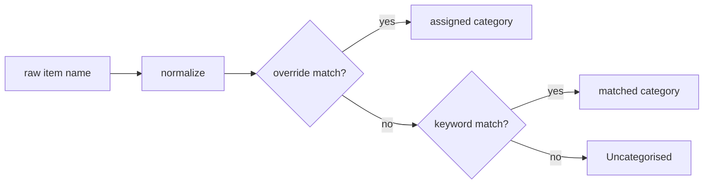
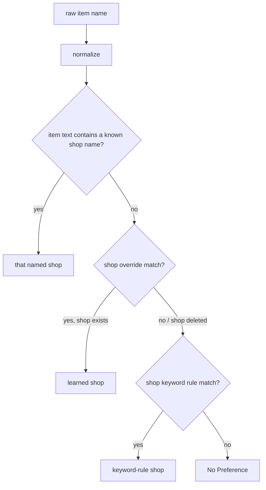

# 07 — Categorisation Engine

Lives in `categoriser.py` as **pure functions** with no `homeassistant` import, so it is fully
unit-testable in isolation (see doc 12 — 100% coverage required here).

## Pipeline

### 1. Normalize

- Lowercase, trim, collapse whitespace.
- Strip leading quantities/units (e.g. `2x`, `500g`, `1 litre`, `a dozen`).
- Strip punctuation except intra-word hyphens/apostrophes.
- Result is the **normalized key** used for both matching and the learned-overrides dict.

### 2. Override match (learning — highest precedence)

- If `normalized in overrides`, assign `overrides[normalized]`. This is how manual corrections
  persist and win over keywords (Req 2.4, 6.2). Resolves gap G2.
- If the override points at a category that no longer exists, fall through to keyword matching
  (self-healing after a category delete). Note: a category **rename** does *not* rely on this
  self-heal — `edit_category` migrates overrides to the new name so learning is preserved (doc 06,
  finding REVIEW2-003).
- Overrides are keyed by **normalized item text**, not `uid`, so learning is uid-independent: if
  an item is deleted on Alexa and a same-named item re-added later (new `uid`), it inherits its
  learned category automatically. (Finding REVIEW2-005.)

### 3. Keyword match

- For each category in order, test whether any keyword matches the normalized text as a
  **whole word / whole phrase, case-insensitive** (a multi-word keyword like "oat milk" matches as
  a contiguous token sequence). First match wins (category order is significant — put more specific
  categories earlier, e.g. `Fake Meat` before generic `Pantry`).
- **Whole-word matching is mandatory, not substring** (finding F4-2). Substring matching would
  mis-categorise across the vegan boundary and beyond: `ham` (Fake Meat) would hit "**gra**ham
  crackers"/"c**ham**omile"; `tea` (Drinks) would hit "s**tea**k"; `roll` (Bakery) would hit
  "**roll**mop" (pickled herring, which must stay animal/Uncategorised). This matches the shop
  resolver, which is also whole-word — the two resolvers use the **same** matching rule.
- `difflib.get_close_matches` fuzzy matching remains an explicitly **deferred** enhancement, behind
  the same pure interface; whole-word exact matching is the v1 behaviour.

### 4. Fallback

- No match → `Uncategorised`. Never guess (Req 1.6, 2.3).

## Vegan rules (non-negotiable — mirrors product steering)

| Item text matches… | Category | Assumption |
|--------------------|----------|------------|
| milk keywords (`milk`, `oat milk`, `soy/soya milk`, `almond milk`, `oat drink`) | **Milk** | plant-based milk |
| dairy-style (`cheese`, `yogurt`/`yoghurt`, `butter`, `cream`) | **Chilled** | plant-based |
| meat keywords (`sausages`, `bacon`, `mince`, `chicken pieces`, `burgers`, `ham`) | **Fake Meat** | plant-based substitute |
| egg / fish / clearly animal-derived (`eggs`, `honey`, `gelatine`, `whey`, `salmon`, `prawns`) | **Uncategorised** | ambiguous/animal → manual review |
| anything else with no match | **Uncategorised** | — |

- There is **no `Dairy` and no `Fish` category** (the `Dairy` in the spec's sample JSON is a
  typo — see doc 01, C3).
- Vegan filtering is **best-effort** on text alone; it cannot catch every hidden animal
  ingredient (NFR4). Ambiguous items route to `Uncategorised` rather than being mis-assigned.
- The Milk/Chilled split is a fixed rule in v1; changing groupings later is a category-map edit
  (Req 6.2), not a code change.

## Bootstrap / seeding (replaces spec's history mining — see doc 01, C2)

On first setup:
1. Load the **default vegan taxonomy** — shipped in `default_map.json` (0.4.0+; data, not
   Python) and read by `defaults.py`; never blocks setup (Req 1.8). The vegan rules and matching
   semantics are unchanged; only the seed's *storage location* moved from Python to JSON. See
   `docs/plans/feature-map-management/`.
2. Read the **current source list including completed items** via `todo.get_items`
   (both statuses) — this is the corpus (completed items are retained by `alexa_devices`).
3. Categorise each corpus item with the default map; anything unmatched sits in
   `Uncategorised`. There is no *blocking* "review before live" gate, because the map only
   affects **display grouping** — it never mutates the Alexa list — so an unreviewed map has a
   cosmetic, fully reversible blast radius. Instead, Req 1.7's intent is met by two
   non-destructive affordances: (a) the card surfaces the `Uncategorised` bucket prominently, and
   (b) on **first setup** the card shows a one-time, dismissible "Review your categories" banner
   linking to the settings panel. This satisfies the *intent* of Req 1.7 (a review opportunity
   before relying on the mapping) without blocking setup (Req 1.8). See doc 15 OQ5 — this
   reinterpretation of a hard SHALL is escalated for human confirmation. (Finding M-1 / F-02.)
4. Optional (future): a one-shot "seed keywords from current list" helper that suggests adding
   frequent uncategorised terms as keywords — deferred, listed in doc 15.

> **Seed source — export path considered and dropped for v1.** Req 1.1 offered "a user-supplied
> export" as an alternative seed source. The plan seeds from the live list (active + completed)
> plus learn-over-time and does **not** implement an import path in v1: with a non-authoritative,
> continuously-learning map, a one-off import adds scope without durable value. It remains a
> possible future optional import. (Finding L-1 / F-01.)

## Meat/milk ambiguity handling

- Because "bacon"/"milk" could in principle be non-vegan, the assumption is plant-based (user
  is vegan). If ever wrong (guest/other household member), the correction path is
  `recategorise_item` / the card's move action (Req 2.4/6.2). A first-seen confirmation prompt
  is a possible enhancement (doc 15), not v1-required.

## Shop resolution (Req 7 — pure, independent of category)

Shop preference is a second pure lookup, resolved for each item **independently** of its category
(one normalize pass feeds both). It lives in the same pure module (no HA import). Resolution
applies a strict **precedence** (Req 7 precedence list).

> **Note (finding F4-6):** unlike the category resolver — where a learned override is highest
> precedence — the shop resolver's tier 1 (shop-name-in-text) **intentionally outranks** the
> learned override. This asymmetry is deliberate (naming the shop in the item text is the most
> explicit signal). Do not "harmonise" the two resolvers; the difference is by design.

### Precedence (highest to lowest)

1. **Explicit shop name in item text (Req 7.4).** If the normalized text contains a known shop
   name as a whole word (e.g. "tesco nappies" → `Tesco`), that shop wins — **even over a learned
   override** for the same text. Rationale: naming the shop in the item is the most explicit signal
   the user can give, and it is what they just typed. (Confirmed decision — see doc 15.)
2. **Learned override (Req 7.2).** If `normalized in shop_overrides` and the target shop still
   exists, assign it. If the override points at a deleted shop, fall through (self-heal, Req 7.6).
3. **Shop keyword rule (Req 7.3).** For each shop in order, if any of its keywords is a whole-word
   match of the normalized text, assign that shop. First match wins (shop order is significant).
4. **No Preference (Req 7.5).** No signal → `No Preference`. Never guessed.

### Notes

- Shop-name matching (tier 1) tests each configured shop's **name** as a **whole word,
  case-insensitive** token in the item text, so "Tesco" in "tesco nappies" matches but "asda"
  inside an unrelated word does not.
- **Collision care for dictionary-word shop names (finding R7-L2):** the default shops
  (Aldi/Asda/Tesco) are safe, but a user could add a shop whose name is a common word (e.g.
  "Fresh", "Local"), which would let tier 1 hijack ordinary items ("fresh bread" → shop "Fresh").
  Mitigations: (a) tier-1 matching is whole-word only (already); (b) `add_shop`/`edit_shop`
  **warn (not block)** when a new shop name is a common English word; (c) as a possible refinement,
  scope tier-1 matching to a leading/trailing token of the item text. This is a documented edge,
  not a v1 blocker.
- Assigning a shop via the card writes a learned override (tier 2). Assigning `No Preference`
  **removes** the override, so the item falls back to keyword rules / No Preference.
- Default shops on first setup: `Aldi`, `Asda`, `Tesco` plus implicit `No Preference`, seeded with
  starter keyword rules — `Aldi`: `nappies`, `milk`; `Asda`: a broad common-clothing set
  (`clothes`/`clothing`, tops like `t-shirt`/`shirt`/`jumper`/`hoodie`, `socks`/`underwear`/`pants`,
  bottoms like `jeans`/`trousers`/`shorts`/`leggings`, `pyjamas`/`jammies`/`pjs`, `dress`/`skirt`,
  outerwear like `coat`/`jacket`, and `shoes`/`trainers`/`slippers`/`hat`/`gloves`/`scarf` — see
  doc 06 for the full list); `Tesco`: none. The default assignment for an unmatched item is
  `No Preference`. Never blocks setup; the user edits shops/keywords freely (Req 7.1).
- `build_projection(...)` returns each item's `category` **and** `shop`; the two are orthogonal.
  The projection is then grouped **shop-primary, then category** (Req 7.7) — see doc 06 contract.

> **Milk example (interaction with categories):** "milk" resolves to category **Milk** (vegan rule)
> and, independently, to shop **Aldi** (shop keyword rule). "oat milk" → category Milk, shop Aldi.
> "tesco milk" → category Milk, shop **Tesco** (shop name in text beats the Aldi keyword rule).

## Determinism & performance

- Pure, deterministic, order-stable. Complexity is O(items × keywords); trivial for
  shopping-list sizes. If lists ever grow large, precompute a keyword→category index — noted,
  not needed for v1.
