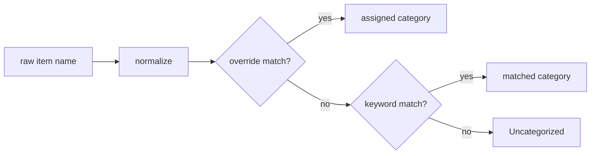

# 07 — Categorization Engine

Lives in `categorizer.py` as **pure functions** with no `homeassistant` import, so it is fully
unit-testable in isolation (see doc 12 — 100% coverage required here).

## Pipeline

### 1. Normalize

- Lowercase, trim, collapse whitespace.
- Strip leading quantities/units (e.g. `2x`, `500g`, `1 litre`, `a dozen`).
- Strip punctuation except intra-word hyphens/apostrophes.
- Result is the **normalized key** used for both matching and the learned-overrides dict.

### 2. Override match (learning — highest precedence)

- If `normalized in overrides`, assign `overrides[normalized]`. This is how manual corrections
  persist and win over keywords (Req 2.4, 6.2). Resolves gap G2.
- If the override points at a category that no longer exists, fall through to keyword matching
  (self-healing after a category delete). Note: a category **rename** does *not* rely on this
  self-heal — `edit_category` migrates overrides to the new name so learning is preserved (doc 06,
  finding REVIEW2-003).
- Overrides are keyed by **normalized item text**, not `uid`, so learning is uid-independent: if
  an item is deleted on Alexa and a same-named item re-added later (new `uid`), it inherits its
  learned category automatically. (Finding REVIEW2-005.)

### 3. Keyword match

- For each category in order, test whether any keyword is a whole-word/substring match of the
  normalized text. First match wins (category order is significant — put more specific
  categories earlier, e.g. `Fake Meat` before generic `Pantry`).
- Start with **substring/word matching (stdlib only)**. Only if match quality proves poor
  should fuzzy matching (`difflib.get_close_matches`, still stdlib) be added — documented as a
  later enhancement, behind the same pure interface.

### 4. Fallback

- No match → `Uncategorized`. Never guess (Req 1.6, 2.3).

## Vegan rules (non-negotiable — mirrors product steering)

| Item text matches… | Category | Assumption |
|--------------------|----------|------------|
| milk keywords (`milk`, `oat milk`, `soy/soya milk`, `almond milk`, `oat drink`) | **Milk** | plant-based milk |
| dairy-style (`cheese`, `yogurt`/`yoghurt`, `butter`, `cream`) | **Chilled** | plant-based |
| meat keywords (`sausages`, `bacon`, `mince`, `chicken pieces`, `burgers`, `ham`) | **Fake Meat** | plant-based substitute |
| egg / fish / clearly animal-derived (`eggs`, `honey`, `gelatine`, `whey`, `salmon`, `prawns`) | **Uncategorized** | ambiguous/animal → manual review |
| anything else with no match | **Uncategorized** | — |

- There is **no `Dairy` and no `Fish` category** (the `Dairy` in the spec's sample JSON is a
  typo — see doc 01, C3).
- Vegan filtering is **best-effort** on text alone; it cannot catch every hidden animal
  ingredient (NFR4). Ambiguous items route to `Uncategorized` rather than being mis-assigned.
- The Milk/Chilled split is a fixed rule in v1; changing groupings later is a category-map edit
  (Req 6.2), not a code change.

## Bootstrap / seeding (replaces spec's history mining — see doc 01, C2)

On first setup:
1. Load the **default vegan taxonomy** (doc 06 storage schema) — never blocks setup (Req 1.8).
2. Read the **current source list including completed items** via `todo.get_items`
   (both statuses) — this is the corpus (completed items are retained by `alexa_devices`).
3. Categorize each corpus item with the default map; anything unmatched sits in
   `Uncategorized`. There is no *blocking* "review before live" gate, because the map only
   affects **display grouping** — it never mutates the Alexa list — so an unreviewed map has a
   cosmetic, fully reversible blast radius. Instead, Req 1.7's intent is met by two
   non-destructive affordances: (a) the card surfaces the `Uncategorized` bucket prominently, and
   (b) on **first setup** the card shows a one-time, dismissible "Review your categories" banner
   linking to the settings panel. This satisfies the *intent* of Req 1.7 (a review opportunity
   before relying on the mapping) without blocking setup (Req 1.8). See doc 15 OQ5 — this
   reinterpretation of a hard SHALL is escalated for human confirmation. (Finding M-1 / F-02.)
4. Optional (future): a one-shot "seed keywords from current list" helper that suggests adding
   frequent uncategorized terms as keywords — deferred, listed in doc 15.

> **Seed source — export path considered and dropped for v1.** Req 1.1 offered "a user-supplied
> export" as an alternative seed source. The plan seeds from the live list (active + completed)
> plus learn-over-time and does **not** implement an import path in v1: with a non-authoritative,
> continuously-learning map, a one-off import adds scope without durable value. It remains a
> possible future optional import. (Finding L-1 / F-01.)

## Meat/milk ambiguity handling

- Because "bacon"/"milk" could in principle be non-vegan, the assumption is plant-based (user
  is vegan). If ever wrong (guest/other household member), the correction path is
  `recategorize_item` / the card's move action (Req 2.4/6.2). A first-seen confirmation prompt
  is a possible enhancement (doc 15), not v1-required.

## Determinism & performance

- Pure, deterministic, order-stable. Complexity is O(items × keywords); trivial for
  shopping-list sizes. If lists ever grow large, precompute a keyword→category index — noted,
  not needed for v1.
