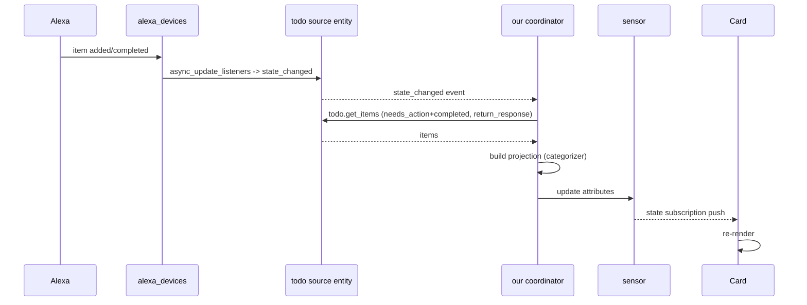

# 08 — Update & Sync Strategy

## Reactivity model

- **Primary trigger:** `async_track_state_change_event` on the source todo entity. The
  `alexa_devices` coordinator pushes Alexa changes and calls `async_update_listeners`, which
  updates the source entity state → fires `state_changed` → our coordinator recomputes.
- **Debounce:** coalesce bursts (~0.5s) so multiple rapid changes cause one recompute.
- **Safety-net poll:** `update_interval = 15 min` calls `todo.get_items` in case a push/state
  update is missed.
- This satisfies "within a few seconds" (NFR1) without us polling Amazon directly. Worst-case
  latency for an Alexa-side change is bounded by the `alexa_devices` push; if push is missed,
  by our 15-min poll (and the underlying 5-min `alexa_devices` poll).

## Inbound flow (read/display)



## Outbound flow: tick-off with undo (per-item)

Grace-period timing lives in the **card** (client-side) so undo is instant and no premature
service call is made. Backend is only touched on finalize.

```mermaid
sequenceDiagram
    participant User
    participant Card
    participant SRC as todo source entity
    User->>Card: tap item
    Card->>Card: mark checked (optimistic), start Ns timer, show Undo
    alt Undo within N s
        User->>Card: tap Undo
        Card->>Card: revert to unchecked, cancel timer
        Note over Card,SRC: no service call was made
    else timer expires
        Card->>SRC: todo.update_item(uid, status=completed)
        SRC-->>Card: (inbound flow reconciles; no-op)
    end
```

- Each item has **independent** undo state and timer (Req 4.5) — the card keeps a
  `Map<uid, pendingState>`.
- N defaults to 9s (option `grace_period_seconds`, echoed in the sensor attributes).
- Because the completion service call happens only on expiry, undo before expiry needs **no**
  reversing call (Req 4.3). If a completion was already sent and the user still wants it back,
  the card can send `todo.update_item(status=needs_action)` (undo works because `alexa_devices`
  supports UPDATE and retains the item).

## Outbound flow: add item

- Card calls `todo.add_item` on the source entity directly (Req 5.2). Optimistically shows the
  item under its predicted category; the inbound flow returns the real item (with its `uid`)
  and reconciles. Duplicate-name safety comes from operating on `uid` post-reconcile (gap G3).

## Identity & duplicates

- All completion/undo operations key on the item **`uid`**, never on display text, so duplicate
  names and renames are handled correctly.

## Idempotency & no-op reconciliation

- After an outbound write, the inbound recompute produces the same projection (the state
  already matches), so it is a visible-no-op — no flicker if the card reconciles by `uid`.

## Stale data handling

- The sensor carries `last_synced`. The card may show a subtle "syncing…" indicator while a
  refresh is in flight and a "last updated" hint. If the coordinator's `last_update_success`
  is false, the card shows a stale/degraded banner (see doc 09).

## Manual refresh

- Provide `homeassistant.update_entity` on the sensor (standard) and/or a card refresh button
  that calls `reload_category_map` or requests a coordinator refresh via
  `homeassistant.update_entity`.
