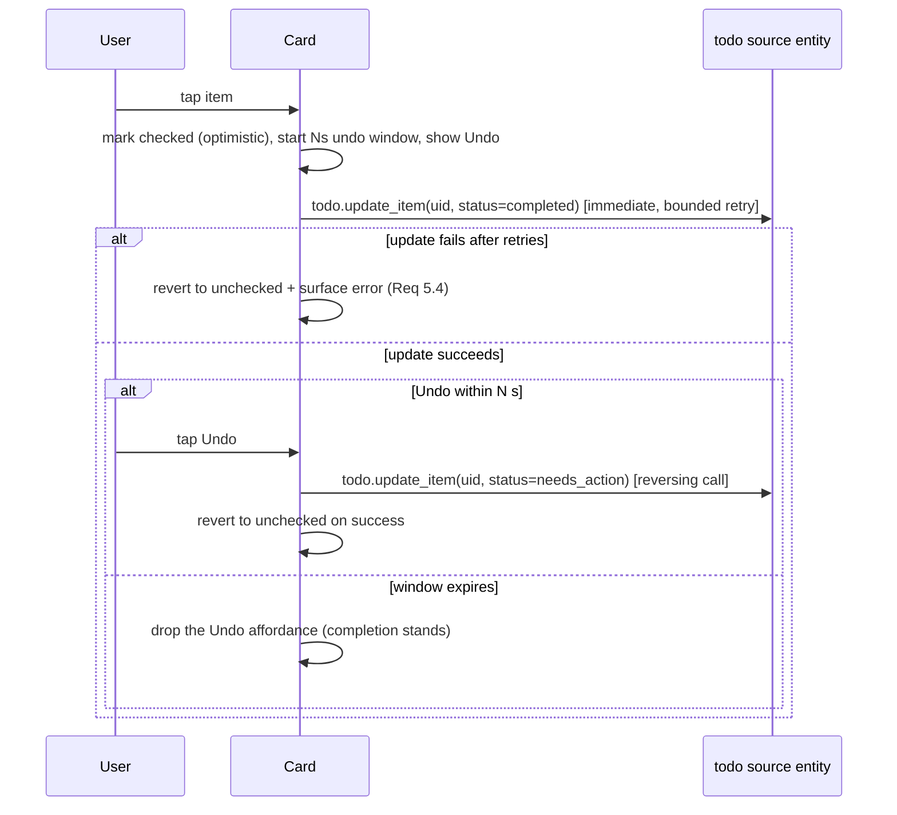

# 08 — Update & Sync Strategy

## Reactivity model

- **Primary trigger:** `async_track_state_change_event` on the source todo entity. The
  `alexa_devices` coordinator pushes Alexa changes and calls `async_update_listeners`, which
  updates the source entity state → fires `state_changed` → our coordinator recomputes.
- **Debounce:** coalesce bursts (~0.5s) so multiple rapid changes cause one recompute.
- **Safety-net poll:** `update_interval = 15 min` calls `todo.get_items` in case a push/state
  update is missed.

### Latency contract (two-tier — finding M-5)

The reactive-delay requirement (Req 2.1 "a few seconds") holds **only when the `alexa_devices`
push fires**. State the bound explicitly:

| Path | Expected latency |
|------|------------------|
| Normal (upstream push works) | A few seconds — satisfies NFR1/Req 2.1 |
| Missed push (fallback) | Up to ~5 min, bounded by the upstream `alexa_devices` 5-min poll (our 15-min safety poll is the outer backstop) |

We never poll Amazon directly. The worst-case ~5-min bound is a known, accepted caveat (doc 15
R3) and must be confirmed acceptable by the user. A manual refresh (below) short-circuits it.

## Inbound flow (read/display)

## Outbound flow: tick-off with undo (complete-on-tap + reversing undo)

**Model (finding H-1).** The completion is sent to the source **immediately on tap**; the grace
window governs only whether the user can *undo*, not whether the change is sent. This guarantees a
tapped item can never be silently lost (Req 5.4) even if the card is closed, backgrounded, or
crashes — the failure direction is "an un-undone completion that is already correctly synced,"
which is safe. It also honours the architecture rule that the backend can enforce the end state
(completion goes through the public `todo.*` service at once, not a deferred client timer).

> **Human-facing note (OQ7 / followup02 FO-1):** because the completion is sent immediately, the
> item appears completed on the Alexa app instantly, not after the ~9s grace window. This is a
> deliberate reinterpretation of Req 4.1's "before finalized" phrasing, escalated for user
> confirmation in doc 15 OQ7.

- Each item has **independent** undo state and timer (Req 4.5) — the card keeps a
  `Map<uid, pendingState>`.
- N defaults to 9s (option `grace_period_seconds`, range 8–30, echoed in the sensor attributes).
- Undo is a **reversing** `todo.update_item(status=needs_action)` (Req 4.3). It works because
  `alexa_devices` supports UPDATE and retains the item (verified `supported_features: 7`).
- **Card closed during the undo window:** the completion is already synced; the only lost
  capability is undo — nothing is dropped. Covered by a test (doc 12).
- **Accepted trade-off (mis-tap):** because completion is sent on tap, a genuine *mis-tap* that
  the user intended to undo, but whose card closed before they could, results in a real completion
  on the Alexa list. For a shopping list this is acceptable — the item is simply marked bought and
  can be re-added — and it is the correct trade-off against the far worse alternative of silently
  losing an intended completion (Req 5.4). This is stated explicitly rather than implied, and
  asserted by a test (doc 12). (Followup01 point 1.)
- **Retry/backoff** applies to the immediate completion call and to the reversing undo call; see
  doc 09. On exhaustion the card reverts optimistic state and surfaces a visible error.

## Outbound flow: add item

- Card calls `todo.add_item` on the source entity directly (Req 5.2). `todo.add_item` does **not**
  return the created `uid`, so a just-added optimistic item has no `uid` to reconcile on yet.
- **Reconciliation key (finding REVIEW2-002):** the card tags the optimistic placeholder with a
  local client token and, on the next inbound refresh, adopts the first inbound `needs_action`
  item whose **normalized `summary`** equals the added text, taking over its real `uid` and
  removing the placeholder. If no match arrives within a bounded window (e.g. 30s), the card drops
  the placeholder and trusts the inbound item (avoids a lingering ghost). After adoption, all
  further operations key on the real `uid` (gap G3).

## Identity & duplicates

- All completion/undo operations key on the item **`uid`**, never on display text, so duplicate
  names and renames are handled correctly.

## Concurrent Alexa-direct change during the undo window (finding M-7)

- **Source wins.** When an inbound refresh shows that a `uid` the card is locally tracking (in
  the undo window) has been **removed or completed/uncompleted on Alexa directly**, the card
  cancels its local undo affordance for that `uid` and adopts the source state.
- Because completion is sent on tap (not deferred), there is no pending finalize call to fire
  against a stale `uid`. The only residual case is a reversing-undo tap racing an inbound delete;
  if the `update_item(status=needs_action)` targets an already-deleted `uid`, it is treated as a
  benign no-op / softly-surfaced handled error, never a hard failure.
- Reconcile-by-`uid` merges inbound state without clobbering an item still within its undo window
  *unless* the source itself changed that item (in which case source wins, as above).

## Idempotency & no-op reconciliation

- After an outbound write, the inbound recompute produces the same projection (the state
  already matches), so it is a visible-no-op — no flicker if the card reconciles by `uid`.

## Stale data handling

- The sensor carries `last_synced`. The card may show a subtle "syncing…" indicator while a
  refresh is in flight and a "last updated" hint. If the coordinator's `last_update_success`
  is false, the card shows a stale/degraded banner (see doc 09).

## Manual refresh

- Provide `homeassistant.update_entity` on the sensor (standard) and/or a card refresh button
  that calls `reload_maps` or requests a coordinator refresh via
  `homeassistant.update_entity`.
