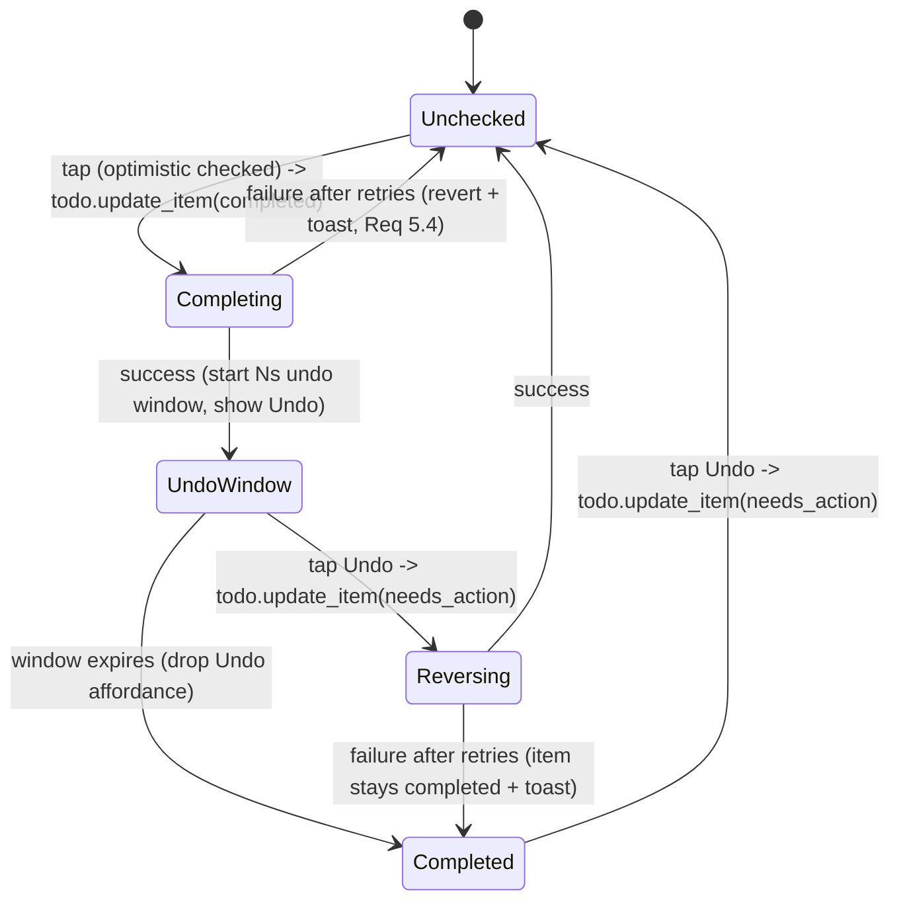

# 11 — Frontend: Custom Lovelace Card

A bundled custom card (`alexa-shopping-categorizer-card`) renders the projection and drives the
tick/undo/add/edit interactions.

## Responsibilities

- Subscribe to the sensor entity (standard `subscribe_entities` websocket) for live updates
  (Req 3.1). No custom websocket API needed.
- Render categories in order, `Uncategorized` last. Collapse/de-emphasize categories with zero
  unchecked items (Req 3.3), honoring the `collapse_empty_categories` option.
- Optimistic tick-off + per-item undo grace period (Req 3.2, 4.1–4.5) — timing is client-side.
- Add-item input → `todo.add_item` on the source entity (Req 5.2).
- Category settings panel → reads the `category_definitions` sensor attribute to display
  categories + their keywords (Req 6.1, finding M-2), and writes via integration services
  (`add/edit/delete_category`, `recategorize_item`).
- **First-setup review affordance (Req 1.7 intent, finding M-1):** on first setup the card shows
  a one-time, dismissible "Review your categories" banner linking to the settings panel, plus a
  prominently-surfaced `Uncategorized` bucket, giving the user a non-blocking review opportunity
  before relying on the mapping.
- Error surfacing (Req 5.4): retries then toast/banner; revert optimistic state on failure.

## State machine (per item) — complete-on-tap + reversing undo (finding H-1)

- The completion is sent **on tap**, not on window expiry, so a closed card never drops it.
- Undo state is tracked independently per `uid` in a `Map` (Req 4.5).
- **Reconciliation (source wins — finding M-7):** when a sensor update arrives, merge by `uid`.
  If the source shows the item was changed/removed on Alexa directly, adopt the source state and
  cancel any local undo affordance for that `uid`. Otherwise, an item in the local undo window
  keeps its optimistic state until the window resolves, so an inbound no-op doesn't clobber the UI.
- **Add reconciliation (finding REVIEW2-002):** an optimistically-added item carries a client
  token (no `uid` yet); on the next refresh the card adopts the first inbound `needs_action` item
  whose normalized summary matches, taking over its real `uid`. Unmatched placeholders are dropped
  after a bounded window.

## Configuration (card options)

- `entity` (the categorized sensor) — required.
- `source_entity` — optional; defaults to the sensor's `source_entity_id` attribute.
- Display toggles mirror backend options but the backend option values (echoed in attributes)
  are the source of truth for grace period etc.

## Interactions → calls

| Interaction | Call |
|-------------|------|
| Tick item (immediate) | `todo.update_item` (source, uid, status=completed) — sent on tap |
| Undo (within window or after) | `todo.update_item` (source, uid, status=needs_action) |
| Add item | `todo.add_item` (source, item=text) |
| Move item's category | `alexa_shopping_categorizer.recategorize_item` (item_text, category, apply_to_uid) |
| Add/edit/delete category | corresponding integration service |
| Manual refresh | `homeassistant.update_entity` (sensor) |

## Security in the card

- Escape all user-supplied text (item names, category names, keywords) — no raw HTML injection.
- Only call documented services; rely on HA session auth. No embedded secrets.

## Accessibility

- Keyboard operable (tab/enter/space to tick, undo), visible focus states, ARIA labels on
  interactive controls, sufficient contrast, and the undo affordance reachable without a mouse.

## Packaging

- Built asset served from the integration (registered as a frontend resource via
  `async_register_static_paths` + `add_extra_js_url`) so users don't hand-install JS. Include
  setup steps in the README.
- **Cache-busting (finding REVIEW2-004):** register the resource URL with the integration
  `version` as a query string (or use a content-hashed filename) so a card update is not masked by
  aggressive browser caching. Bump on every card build.
