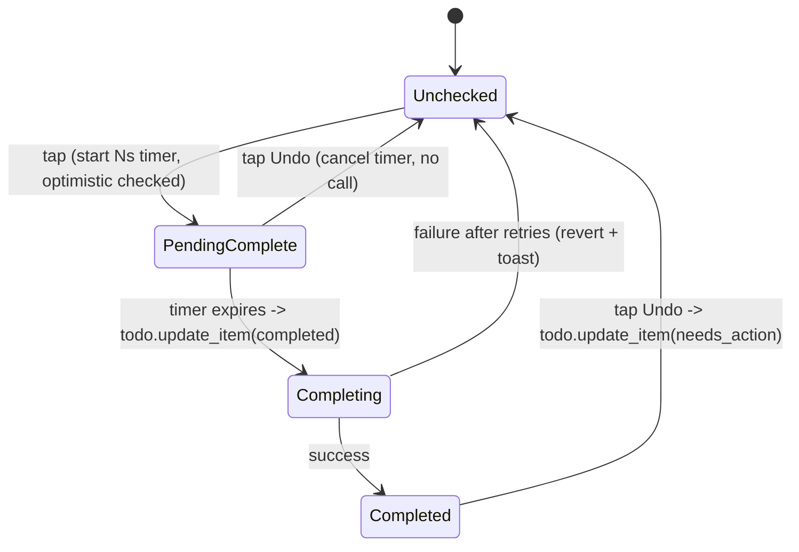

# 11 — Frontend: Custom Lovelace Card

A bundled custom card (`alexa-shopping-categorizer-card`) renders the projection and drives the
tick/undo/add/edit interactions.

## Responsibilities

- Subscribe to the sensor entity (standard `subscribe_entities` websocket) for live updates
  (Req 3.1). No custom websocket API needed.
- Render categories in order, `Uncategorized` last. Collapse/de-emphasize categories with zero
  unchecked items (Req 3.3), honoring the `collapse_empty_categories` option.
- Optimistic tick-off + per-item undo grace period (Req 3.2, 4.1–4.5) — timing is client-side.
- Add-item input → `todo.add_item` on the source entity (Req 5.2).
- Category settings panel → integration services (`add/edit/delete_category`,
  `recategorize_item`).
- Error surfacing (Req 5.4): retries then toast/banner; revert optimistic state on failure.

## State machine (per item)

- Undo state is tracked independently per `uid` in a `Map`.
- Reconciliation: when a sensor update arrives, merge by `uid`; an item in local
  `PendingComplete` keeps its local state until its timer resolves, so an inbound no-op doesn't
  clobber the pending UI.

## Configuration (card options)

- `entity` (the categorized sensor) — required.
- `source_entity` — optional; defaults to the sensor's `source_entity_id` attribute.
- Display toggles mirror backend options but the backend option values (echoed in attributes)
  are the source of truth for grace period etc.

## Interactions → calls

| Interaction | Call |
|-------------|------|
| Tick item (finalize) | `todo.update_item` (source, uid, status=completed) |
| Undo a completed item | `todo.update_item` (source, uid, status=needs_action) |
| Add item | `todo.add_item` (source, item=text) |
| Move item's category | `alexa_shopping_categorizer.recategorize_item` (item_text, category, apply_to_uid) |
| Add/edit/delete category | corresponding integration service |
| Manual refresh | `homeassistant.update_entity` (sensor) |

## Security in the card

- Escape all user-supplied text (item names, category names, keywords) — no raw HTML injection.
- Only call documented services; rely on HA session auth. No embedded secrets.

## Accessibility

- Keyboard operable (tab/enter/space to tick, undo), visible focus states, ARIA labels on
  interactive controls, sufficient contrast, and the undo affordance reachable without a mouse.

## Packaging

- Built asset served from the integration (registered as a frontend resource) so users don't
  hand-install JS. Include setup steps in the README.
